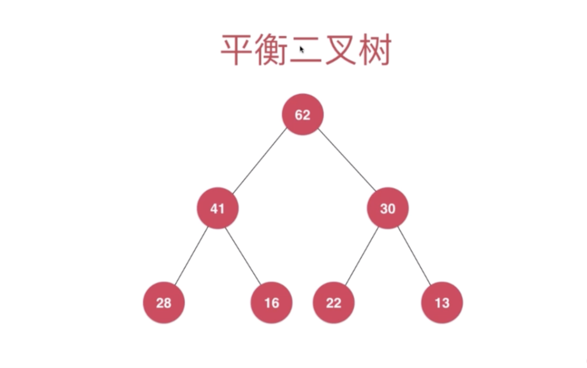
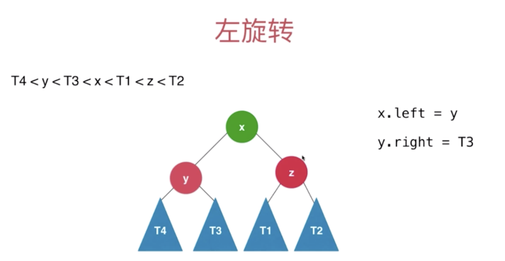

# JavaDataStructure

Java实现基本数据结构

### Array

### Queue

- 队列（数组实现）
- 循环队列（数组实现）
    
### Stack
    
- 数组实现
    
### LinkedList

- LinkedList
- LinkedListStack
- LinkedListQueue
   
### BinarySearchTree

- preOrder() 前序遍历
- inOrder() 中序遍历
- postOrder() 后序遍历
  
### Heap

- MaxHeap(底层用动态数组)
   
### PriorityQueue

- 底层MaxHeap
   
### Set
    
无重复元素

- 链表实现 

    - add（） O（1）为了保证不重复 首先需要查找O(N) 最终时间复杂度O(N) 
    - contains() O(N) 
    - remove（）O(N) 

- 二分搜索树实现
    
    - add()
        复杂度：二分搜索树 O(H) h为搜索树的高度  2^(h-1) + ··· + 2^0 = 2 ^ h  - 1 = n 
        O(h) = O(log2n)
    - contains()
        复杂度：O(H) h为搜索树的高度 O(logN)
    - remove()
        复杂度：O(H) h为搜索树的高度 O(logN)    
    - logN 和 N 的区别
        随着N的增大 越差越大
   
-  二分搜索树 退化成链表（按照顺序排列）

- Leetcode issue

    - 804 摩斯密码问题
    
- 有序集合 无序集合

    - 有序集合 的元素具有顺序性  (搜索树)
    - 无序集合中的元素没有顺序性 （基于哈希表）
    
- 多重集合

    允许容纳重复元素
    
### Map 映射 存储键值对的数据结构

- 链表 LinkedMap<K,V>

    复杂度：
     - add          O(N)
     - remove       O(N)
     - set          O(N)
     - get          O(N)
     - contains     O(N)

- 二分搜索树 BSTreeMap<K,V>

    复杂度：
    - add           O(logN)
    - remove        O(logN)
    - set           O(logN)
    - get           O(logN)
    - contains      O(logN)

- **NOTE** 集合映射关系

    - 基于Map 包装 Set 

### 线段树（Segment Tree）

不考虑添加，删除，只考虑区间内的元素

- 每个节点保存的是区间的信息
- 子节点平均划分段（区间）
- 最后一层的叶子节点 只有一个元素
- 不是完全二叉树，是平衡二叉树（最大的深度最小深度差最多为1）
- 如果要有n个元素，需要4n的静态空间
- Issue
    
    - 区间染色
    - 区间查询
   
        基于区间的统计查询
   
### 并查集（Union Find）

- 对于一组数据，主要支持两个动作
    
    - union(p,q) 合并
    - isConnected(p,q) 查询两个数据是否属于同一个集合 -->find(p) == find(q) 

- Quick Find 时间复杂度O（1）
 
    
    
    
    
    
    
- Quick Union

   - 将每个元素，看作是一个节点
   
   
   
   
   
   
   
   
   
   
   
   > 1. 将 7 和 2 合并 ，需将 7 的根节点指向 2
   > 2. 将 7 和 3 合并 ，需将 7 的根节点指向 3 的根节点，结果同上
   > 每个节点本身只有一个指针，只会指向另外一个元素
   
- 优化

    - Size
    - Rank : 高度
        - rank[i] 表示根节点为i的树的高度
    - 路径压缩 
        
        
        
        
        
        
- 并查集的时间复杂度分析

    - O(h)
    - O(log*n) --> iterated logarithm (路径压缩)
        
        近乎 O（1）   

### 平衡二叉树 与 AVL树

- 二分搜索树的问题
      
      - ISSUE 
      > 数据顺序添加到二分搜索树，蜕化成链表
        
- 平衡二叉树
    
    - 满二叉树
    
    > 高度达到最低状态，除了叶子节点，其他节点都有左右两个子树
    
    - 完全二叉树
    
    > 把所有的元素按照形状一层一层铺开，最终得到一颗完全二叉树
    > 有可能有一颗非叶子节点的右子树为空（eg.16节点）
    > 整棵树的叶子结点最大深度值与最小深度值不超过1
    
    - 线段树
    
    > 叶子节点或者在最后一层，或者在倒数第二层
    > 整棵树的叶子结点最大深度值与最小深度值不超过1
    

> 对于任意一个节点，左子树和右子树的高度差不能超过1
> 不会在堆、线段树中出现  
> 平衡二叉树的高度和节点数量直接的关系也是O(logN)的 
> 标注节点的高度
> 计算平衡因子：左右两个子树高度差

- AVL树

Author: G . M . Adelson-Velsky 和 E. M. Landis

1962年提出，最早的自平衡二叉树

对于任意一个节点，左子树和右子树的高度差不能超过1   
    - 什么时候维护平衡
     
     
     
     
    - 平衡因子大于1，&& 左侧的节点多添加了 --> 导致不平衡 --> 右旋转
    
    - 平衡因子小于-1，&& 右侧的节点多添加了 --> 导致不平衡 --> 左旋转
    
    - 平衡因子大于1，&& 节点右侧多添加了 --> 导致不平衡 --> 左旋转 --> 右旋转
     
    - 平衡因子小于-1，&& 节点左侧多添加了 --> 导致不平衡 --> 右旋转 --> 左旋转
     
    

   
